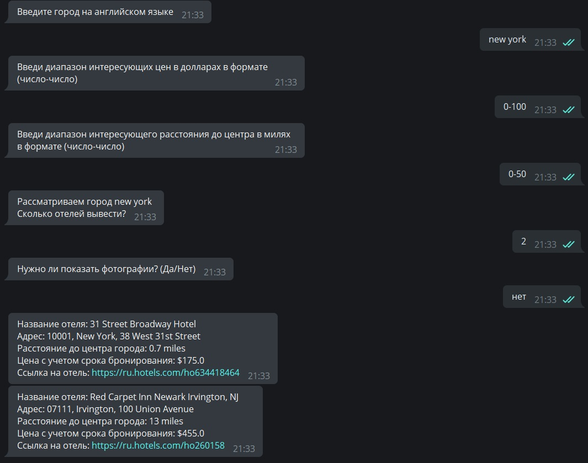
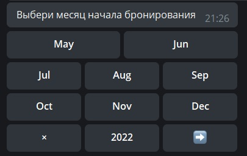

# <center>**hotel_analysis_bot**


## **Description**
____

The bot was developed from scratch in Python. For implementation, the pytelegrambotapi library was taken as a basis, which is a convenient and lightweight library for creating bots on Pyrhon for a telegram.
The bot performs 4 main functions, namely:

+ lowprice - selection of the cheapest hotels in the city
+ highprice - selection of the expensive hotels in the city
+ bestdeal - selection of hotels that are most suitable for price and       location from center
+ history - hotel search history output


For lowprice, highprice and bestdeal commands, command result message
contains brief information on each hotel. Into this information
includes:

+ name of the hotel
+ address
+ how far is it from the center
+ price
+ N photos of the hotel (if the user deems it necessary to display them)

For the development of the project, the open API Hotels is used, which is located on the website rapidapi.com.

```python
def id_city(user_input: str) -> int:
    url = "https://hotels4.p.rapidapi.com/locations/v2/search"

    querystring = {"query": user_input}

    response = requests.request("GET", url, headers=headers, params=querystring)
    data = json.loads(response.text)

    for i_group in data['suggestions']:
        if i_group['group'] == 'CITY_GROUP':
            if len(i_group['entities']) > 0:
                return i_group['entities'][0]['destinationId']
            else:
                return 0


def about_city(city_id: int) -> dict:
    url = "https://hotels4.p.rapidapi.com/properties/list"

    querystring = {"destinationId": city_id}

    response = requests.request("GET", url, headers=headers, params=querystring)
    data = json.loads(response.text)
    return data


def city_hotels(user_input: str) -> Union[int, list[dict]]:
    if id_city(user_input) == 0:
        return 0
    else:
        hotels: list = about_city(id_city(user_input))['data']['body']      ['searchResults']['results']
        return hotels
```

## **Main functions**
____
### **lowprice**
After entering the command, the user is prompted:
+ The city where the search will be carried out.
+ The number of hotels to display as a result (no more than
predetermined maximum).
+ The need to upload and display photos for each hotel (“Yes / No”)
+ If the answer is yes, the user also enters the amount
necessary photographs (no more than a predetermined
maximum)


### **highprice**
After entering the command, the user is prompted:
+ The city where the search will be carried out.
+ The number of hotels to display as a result (no more than
predetermined maximum).
+ The need to upload and display photos for each hotel (“Yes / No”)
+ If the answer is yes, the user also enters the amount
necessary photographs (no more than a predetermined
maximum)


### **bestdeal**
After entering the command, the user is prompted:
+ The city where the search will be carried out.
+ Price range.
+ Range of distance at which the hotel is located from the center.
+ The number of hotels to display as a result (no more than
predetermined maximum).
+ The need to upload and display photos for each hotel (“Yes / No”)
+ If the answer is yes, the user also enters the amount
necessary photographs (no more than a predetermined
maximum)



Added calendar functionality to all of the above commands (booking a hotel for certain dates).





The calendar is implemented using the telegram_bot_calendar library.

```python
calendar, step = MyStyleCalendar(min_date=datetime.datetime.today().date()).build()

    def call_start_booking_low(call) -> None:
        result, key, step = MyStyleCalendar(min_date=datetime.datetime.today().date()).process(call.data)
        if not result and key:
            if LSTEP[step] == 'month':
                bot_step = 'месяц'
            elif LSTEP[step] == 'day':
                bot_step = 'день'
            bot.edit_message_text(f"Выбери {bot_step} начала бронирования",
                                  call.message.chat.id,
                                  call.message.message_id,
                                  reply_markup=key)
        elif result:
            bot.edit_message_text(f"Дата начала бронирования {result}",
                                  call.message.chat.id,
                                  call.message.message_id)

```

### **history**
After entering the command, the user is shown the search history of hotels. The story itself
contains:
+ The command entered by the user.
+ Date and time the command was entered.
+ Hotels that were found.


## **Additional functions**
____
### **help**
Help with bot commands.

```python
    def helper(message, user_id, user_message) -> Any:
        help_commands = '/lowprice - покажу топ самых дешёвых отелей в  городе\n' \
                        '/highprice - покажу топ самых дорогих отелей в городе\n' \
                        '/bestdeal - покажу топ отелей, наиболее подходящих по цене и расположению от центра\n' \
                        '/history - покажу историю поиска отелей'

        bot.send_message(message.chat.id, help_commands)
```


## **Start**
____
The /start command is used to get started. After entering the command, one of three greetings is displayed and a suggestion to use the help function to remind existing bot commands.

```python
    def hello(message) -> None:
        greetings = {
            1: f'Привет, {message.from_user.first_name}!\nОчень рад тебя видеть!',
            2: f'Хай! Кто же ко мне пришел! {message.from_user.first_name}! Рад встрече!',
            3: f'Доброго времени суток, {message.from_user.first_name}!'
        }
        greetings_questions = {
            1: 'Хочешь узнать, что я умею?',
            2: 'Напомнить, что я умею?',
            3: 'Если не помните мои возможности, нажмите на кнопку "Да".'
        }
        choice = random.randint(1, 3)

        bot.send_message(message.chat.id, text=greetings[choice])
        keyboard = types.InlineKeyboardMarkup()
        help_button_yes = types.InlineKeyboardButton(text='Да', callback_data='helper')
        help_button_no = types.InlineKeyboardButton(text='Нет', callback_data='none')
        keyboard.add(help_button_yes, help_button_no)
        bot.send_message(message.chat.id, greetings_questions[choice], reply_markup=keyboard)
```


